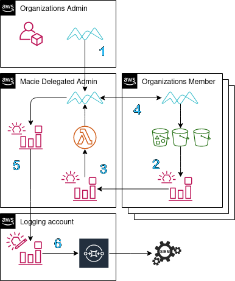

# SEC310: Data protection at scale using Enhanced Macie



### Getting started

1. [Delegate an administrator account](https://docs.aws.amazon.com/macie/latest/user/macie-organizations.html)

Macie allows for a similar delegation to the GuardDuty service, so a single
account can act as the orchestrator. Delegating an account admin means that all
of the findings generated from jobs will be available for download in the
console or using the API and this account now has readonly access to
Organizations data.

The admin account can then enable and manage Macie in all of the member
accounts. It is also possible to to integrate accounts that live outside of the
admin's organization by inviting it.

2. Aggregate S3 lifecycle events for creating and canceling classification jobs

Using EventBridge, a rule can be deployed to each account that should be brought
into scope which matches for `s3:CreateBucket` and `s3:DeleteBucket`. As a
target for the rule, a custom event bus can be set up in the delegated
administrator account.

Tracking the lifecycle of an S3 bucket allows for creation and cancelation of
classification jobs. When creating a job, it can be beneficial to flesh out the
`s3JobDefinition` which can allow object level scoping based on file attributes
or tags. Additional custom classifiers can be added as well as adjusting the job
to be scheduled. For canceling a job, all jobs are listed looking for the job
containing the single bucket that has been deleted.

3. Route the Macie findings to the proper teams infrastructure

Setting up a rule from the pre-baked patterns that EventBridge provides, Macie
finding events can be captured. This is the same data that is aggregated in the
console when viewing or exporting. Establishing a similar architecture as above,
these events of a sensitive data being identified and classified can be routed
into a different account for additional analysis (SIEM/logging account).

The rule that is provisioned in the admin account currently has no targets set.
This will allow for optional routing into the the desired resoucres or simply
deleting the rule and taking advantage of the console which allows for
exporting.

### Deploying

There are effectively two pieces that need to be deployed, one is the
EventBridge rule living in the member accounts which will capture events and
aggregate them back to the second half which will manage classification job
management.

1. Deploy the SAM application into the delegated admin account
```
sam build -t template.cfn.yaml
sam deploy
```
2. Deploy `eventrules.cfn.yaml` as a stackset

https://docs.aws.amazon.com/macie/latest/user/macie-organizations.html

https://aws.amazon.com/blogs/architecture/bbva-architecture-for-large-scale-macie-implementation/

https://aws.amazon.com/blogs/mt/bbva-automated-responses-through-event-management-scale/

https://boto3.amazonaws.com/v1/documentation/api/latest/reference/services/macie2.html
